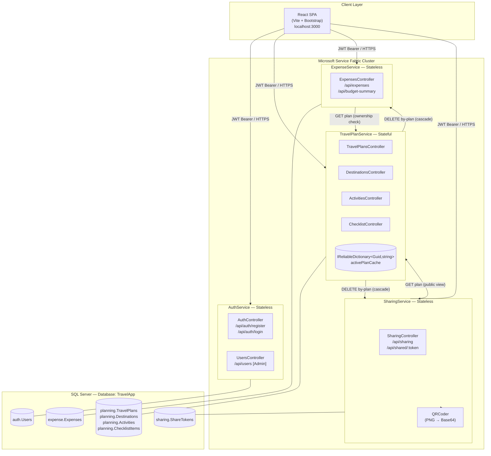
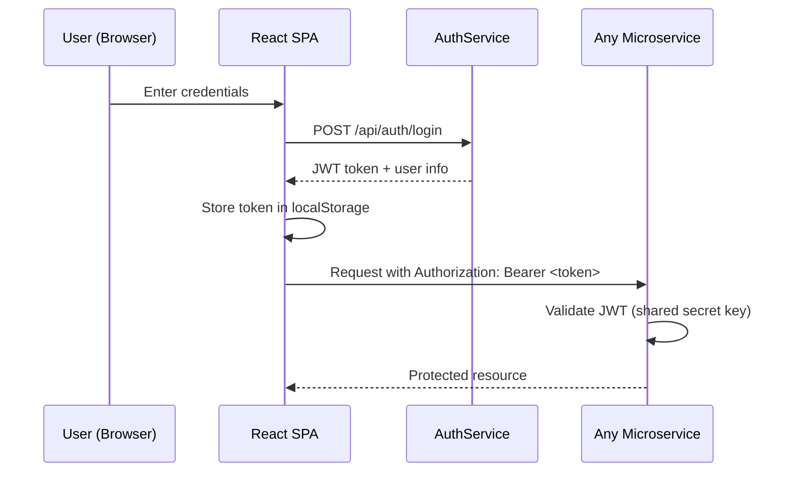
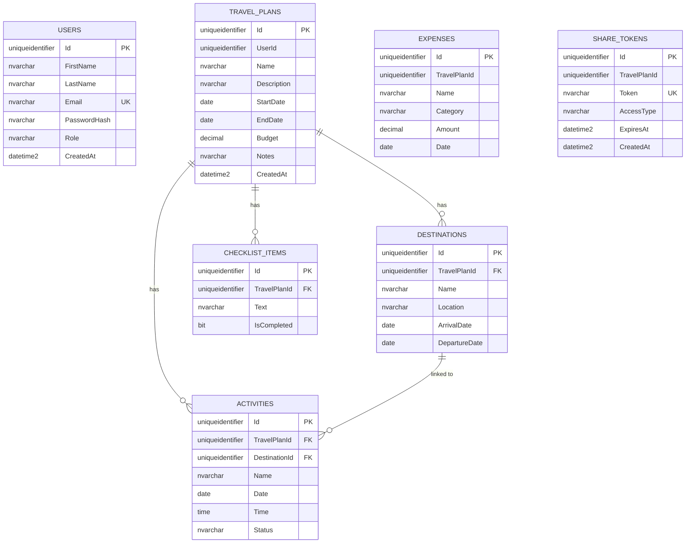

# Architecture Diagram

## System Architecture — TravelPlanner

## Component Breakdown

### AuthService (Stateless)
- Issues and validates JWT tokens (7-day expiry)
- Passwords hashed with BCrypt
- Admin-only user management endpoints

### TravelPlanService (Stateful)
- Owns all travel planning data
- Uses `IReliableDictionary` as an in-memory plan cache (Service Fabric Reliable Collections)
- On plan deletion, fires HTTP DELETE calls to ExpenseService and SharingService to cascade-delete related data
- Exposes a public `/public` endpoint used by the shared plan view (no auth required)

### ExpenseService (Stateless)
- Tracks expenses per travel plan with categories
- Computes budget summary (planned vs. spent, breakdown by category)
- Verifies plan ownership by calling TravelPlanService with the user's JWT

### SharingService (Stateless)
- Generates unique share tokens (64-char hex GUID)
- Produces QR codes (PNG, returned as Base64) pointing to the frontend share URL
- Supports VIEW and EDIT access types with optional expiry
- Reads plan data from TravelPlanService for the public share page

## Authentication Flow

## Data Schema Relationships

> **Note:** `EXPENSES` and `SHARE_TOKENS` reference `TravelPlanId` logically but live in separate database schemas with no physical foreign key constraints. Cross-schema data integrity is enforced at the service layer via HTTP.
