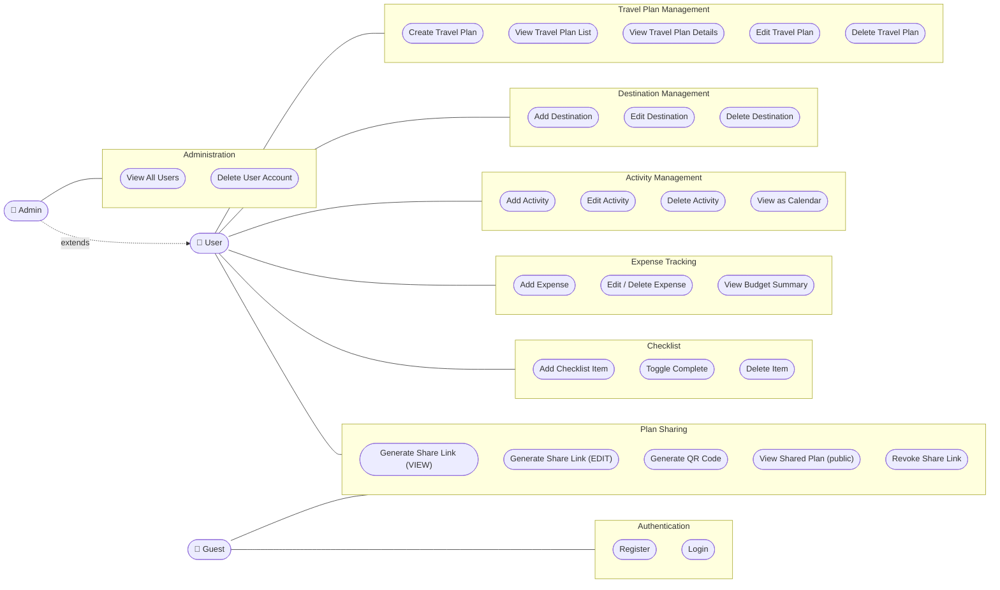

# Use Case Diagram

## Actors

| Actor | Description |
|---|---|
| **Guest** | Unauthenticated visitor. Can register, log in, and view shared plans via a token link. |
| **User** | Authenticated registered user. Full CRUD on own travel plans and all sub-resources. |
| **Admin** | Authenticated user with the Admin role. Inherits all User capabilities plus user management. |

## Use Case Diagram

## Use Case Descriptions

### Authentication

| ID | Use Case | Actor | Description |
|---|---|---|---|
| UC1 | Register | Guest | Provide first name, last name, email, and password. Account is created with the `User` role. |
| UC2 | Login | Guest | Provide email and password. Receive a JWT token valid for 7 days. |

### Travel Plan Management

| ID | Use Case | Actor | Precondition |
|---|---|---|---|
| UC3 | Create Travel Plan | User | Logged in. Provide name, dates, and budget. |
| UC4 | View Travel Plan List | User | Logged in. Only own plans are returned. |
| UC5 | View Travel Plan Details | User | Plan exists and belongs to the user. |
| UC6 | Edit Travel Plan | User | Plan exists and belongs to the user. |
| UC7 | Delete Travel Plan | User | Plan exists and belongs to the user. Cascades to all destinations, activities, checklist items, expenses, and share tokens. |

### Destination Management

| ID | Use Case | Actor | Precondition |
|---|---|---|---|
| UC8 | Add Destination | User | Plan exists and belongs to the user. |
| UC9 | Edit Destination | User | Destination exists in an owned plan. |
| UC10 | Delete Destination | User | Destination exists in an owned plan. Activities linked to this destination lose their destination reference (SET NULL). |

### Activity Management

| ID | Use Case | Actor | Precondition |
|---|---|---|---|
| UC11 | Add Activity | User | Plan exists and belongs to the user. Activity can optionally be linked to a destination. |
| UC12 | Edit Activity | User | Activity exists in an owned plan. |
| UC13 | Delete Activity | User | Activity exists in an owned plan. |
| UC14 | View as Calendar | User | Activities are grouped by date in a day-by-day calendar layout. |

### Expense Tracking

| ID | Use Case | Actor | Precondition |
|---|---|---|---|
| UC15 | Add Expense | User | Plan exists and belongs to the user. Provide name, amount, category, and date. |
| UC16 | Edit / Delete Expense | User | Expense exists in an owned plan. |
| UC17 | View Budget Summary | User | Plan exists. Shows planned budget, total spent, remaining amount, and breakdown by category. |

### Checklist

| ID | Use Case | Actor | Precondition |
|---|---|---|---|
| UC18 | Add Checklist Item | User | Plan exists and belongs to the user. |
| UC19 | Toggle Complete | User | Item exists in an owned plan. Toggles `IsCompleted` flag. |
| UC20 | Delete Item | User | Item exists in an owned plan. |

### Plan Sharing

| ID | Use Case | Actor | Precondition |
|---|---|---|---|
| UC21 | Generate VIEW Link | User | Plan exists and belongs to the user. Recipients can only read the plan. |
| UC22 | Generate EDIT Link | User | Plan exists and belongs to the user. Recipients with the link can edit the plan (access type stored in token). |
| UC23 | Generate QR Code | User | Automatically generated together with the share link. Returned as a Base64-encoded PNG image. |
| UC24 | View Shared Plan | Guest | A valid, non-expired share token exists. The plan is displayed publicly without requiring login. |
| UC25 | Revoke Share Link | User | Token exists and was created for an owned plan. |

### Administration

| ID | Use Case | Actor | Precondition |
|---|---|---|---|
| UC26 | View All Users | Admin | Logged in with Admin role. Returns all registered accounts. |
| UC27 | Delete User Account | Admin | Logged in with Admin role. Cannot delete own account. |
